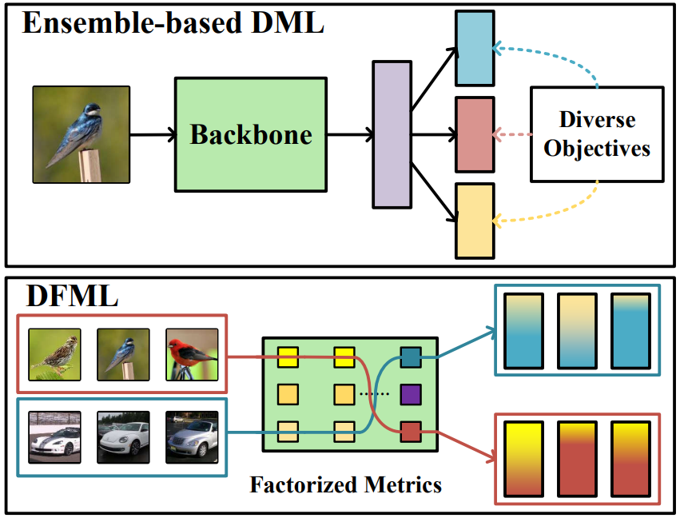

# Deep Factorized Metric Learning

This repository is the official implementation of **Deep Factorized Metric Learning**. 

## Introduction

Learning a generalizable and comprehensive similarity metric to depict the semantic discrepancies between images is the foundation of many computer vision tasks. While existing methods approach this goal by learning an ensemble of embeddings with diverse objectives, the backbone network still receives a mix of all the training signals. Differently, we propose a deep factorized metric learning (DFML) method to factorize the training signal and employ different samples to train various components of the backbone network. We factorize the network to different sub-blocks and devise a learnable router to adaptively allocate the training samples to each sub-block with the objective to capture the most information. The metric model trained by DFML capture different characteristics with different sub-blocks and constitutes a generalizable metric when using all the sub-blocks. The proposed DFML achieves state-of-the-art performance on all three benchmarks for deep metric learning including CUB-200-2011, Cars196, and Stanford Online Products. We also generalize DFML to the image classification task on ImageNet-1K and observe consistent improvement in accuracy/computation trade-off. Specifically, we improve the performance of ViT-B on ImageNet (+0.2\% accuracy) with less computation load (-24\% FLOPs).

## Motivation



Ensemble-based DML learns an ensemble of embeddings where diverse objectives are employed. Differently, DFML factorizes the backbone and learns a certain routine for each sample to achieve the diversity of features, which further boosts the generalization ability of the model on unseen classes.

## Framewrok

Architecturally, our DCML framework is as follows:


## Datasets 
The datasets should be organized in the data folder.
### CUB-200-2011

Download from [here](http://www.vision.caltech.edu/visipedia/CUB-200-2011.html).

Organize the dataset as follows:

```
- CUB_200_2011
    |- images
    |   |- 001.Black_footed_Albatross
    |   |   |- Black_Footed_Albatross_0001_796111
    |   |   |- ...
    |   |- ...
```

### Cars196

Download from [here](http://ai.stanford.edu/~jkrause/cars/car_dataset.html).

Organize the dataset as follows:

```
- cars196
    |- car_ims
    |   |- image000001
    |   |- ...
    |- cars_annos.mat
```

### Stanford Online Products

Download from [here](http://cvgl.stanford.edu/projects/lifted_struct/)

Organize the dataset as follows:

```
- Standford_Online_Products
    |- bicycle_final
    |   |- image0
    |   |- ...
    |- ...
    |- Ebay_train.txt
    |- Ebay_test.txt
```

## Requirements
- Python3
- PyTorch (>1.0)
- NumPy
- wandb
- timm

## Training
We provide the training settings of our DFML framework with the ProxyAnchor loss on three datasets, which achieves state-of-the-art performances compared with previous methods.

### Model Convertion
To convert the pretrained models to the factorized forms as illustrated in our paper, run this command: (we adopt the distilled deit-small model as example)

```
python convert.py \
--input deit_small_distilled_patch16_224-649709d9.pth \
--output pretrained_files/deit_small_distilled_factorized.pth
```

Note that the 'deit_small_distilled_patch16_224-649709d9.pth' model can be downloaded from timm.

### CUB-200-2011

To train the proposed DFML framework using the ProxyAnchor loss on CUB200 in the paper, run this command:

```
CUDA_VISIBLE_DEVICES=0 python train.py \
--loss Proxy_Anchor \
--model deit_small_distilled_patch16_224 \
--embedding-size 384 \
--batch-size 120 \
--lr 1e-4 \
--dataset cub \
--warm 5 \
--bn-freeze 1 \
--lr-decay-step 5
--readpath 'pretrained_files/deit_small_distilled_factorized.pth'
```

| Method | Backbone | R@1 | R@2 | NMI | RP | MAP@R |
|:-:|:-:|:-:|:-:|:-:|:-:|:-:|
| DFML-PA | ResNet-50 | 79.1 | 86.8 | 80.2 | 47.3 | 37.4 |

### Cars196

To train the proposed DFML framework using the ProxyAnchor loss on Cars196 in the paper, run this command:

```
CUDA_VISIBLE_DEVICES=0 python train.py \
--loss Proxy_Anchor \
--model deit_small_distilled_patch16_224 \
--embedding-size 384 \
--batch-size 120 \
--lr 1e-4 \
--dataset cars \
--warm 5 \
--bn-freeze 1 \
--lr-decay-step 10
--readpath 'pretrained_files/deit_small_distilled_factorized.pth'
```

| Method | Backbone | R@1 | R@2 | NMI | RP | MAP@R |
|:-:|:-:|:-:|:-:|:-:|:-:|:-:|
| IDML-PA | ResNet-50 | 89.5 | 93.9 | 76.8 | 40.6 | 31.0 |

### Stanford_Online_Products

To train the proposed DFML framework using the ProxyAnchor loss on SOP in the paper, run this command:

```
CUDA_VISIBLE_DEVICES=0 python train.py \
--loss Proxy_Anchor \
--model deit_small_distilled_patch16_224 \
--embedding-size 384 \
--batch-size 120 \
--lr 6e-4 \
--dataset SOP \
--warm 1 \
--bn-freeze 0 \
--lr-decay-step 10 \
--lr-decay-gamma 0.25
--readpath 'pretrained_files/deit_small_distilled_factorized.pth'
```

| Method | Backbone | R@1 | R@10 | NMI | RP | MAP@R |
|:-:|:-:|:-:|:-:|:-:|:-:|:-:|
| IDML-PA | ResNet-50 | 84.2 | 93.8 | 94.1 | 62.6 | 59.7 |

## Device 

We tested our code on a linux machine with 8 Nvidia RTX 2080ti GPU cards. 

## Citation

If you find this project useful in your research, please cite:

````
@inproceedings{wang2023deep,
  title={Deep Factorized Metric Learning},
  author={Wang, Chengkun and Zheng, Wenzhao and Li, Junlong and Zhou, Jie and Lu, Jiwen},
  booktitle={Proceedings of the IEEE/CVF Conference on Computer Vision and Pattern Recognition},
  pages={7672--7682},
  year={2023}
}
````
